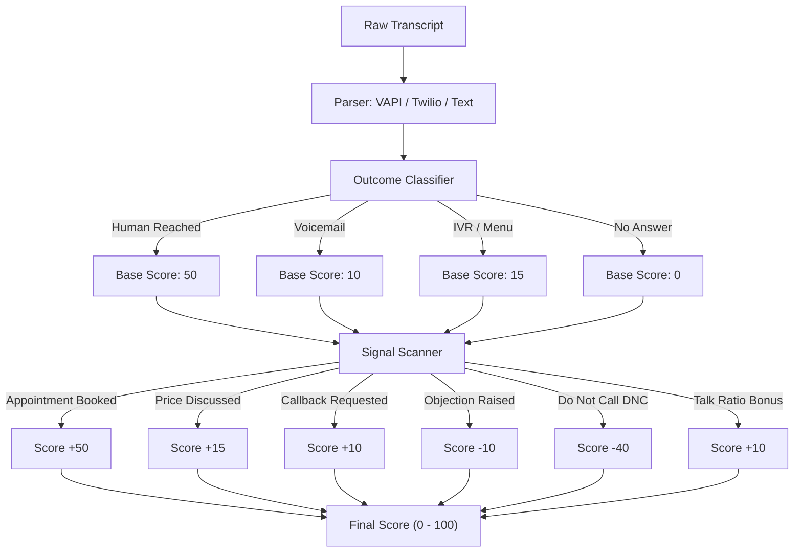

# callscope

**Outcome analytics and quality scoring for AI voice-agent calls.** Point it at your transcripts and get back what actually happened: did the call reach a human, hit a voicemail, or die in an IVR menu? Did the customer object, ask about price, or book? How good was the conversation, on a 0 to 100 scale?

[](https://github.com/redzicdenis08-afk/callscope/actions/workflows/ci.yml)
[](LICENSE)
[](https://www.python.org/)
[](https://github.com/astral-sh/ruff)
[](CONTRIBUTING.md)

Built for teams running outbound or inbound AI voice agents (VAPI, Retell, Bland, Twilio, or anything that produces a transcript). Stop eyeballing thousands of calls one by one. Score them.

---

## Why this exists

If you run AI cold-callers or receptionists at any real volume, your biggest blind spot is the gap between *"the call connected"* and *"something good happened."* Provider dashboards tell you a call succeeded. They don't tell you that a big chunk of those "successful" calls were voicemails, or that humans bailed in the first ten seconds. `callscope` turns a pile of raw transcripts into the few numbers you actually steer on.

Zero runtime dependencies. Pure standard library. Runs offline. Bring your own LLM key only if you opt into the deeper-classification mode (on the roadmap).

## Install

```bash
pip install -e .          # from source
pip install callscope     # from PyPI (coming soon)
```

## Quickstart

### CLI

```bash
python -m callscope analyze examples --csv report.csv --jsonl report.jsonl
```

```
CALL              OUTCOME         SCORE  EVENTS
--------------------------------------------------------
call_demo_001     human_reached     100  price_discussed, appointment_booked, callback_requested
sample_plain      voicemail          12  -
--------------------------------------------------------
2 call(s) | 1 reached a human | 1 booked | avg score 56.0
```

### Library

```python
from callscope import analyze

report = analyze(open("calls/call_demo_001.json").read(), fmt="vapi")

report.outcome   # "human_reached"
report.events    # ["price_discussed", "appointment_booked", "callback_requested"]
report.score     # 100
report.metrics   # {"turns": 8, "customer_turns": 4, "customer_talk_ratio": 0.41, ...}
```

## What it detects

| Outcome | Meaning |
|---|---|
| `human_reached` | A real person engaged in the conversation |
| `voicemail` | Hit an answering machine or voicemail greeting |
| `ivr` | Stuck in a phone menu ("press 1 for sales") |
| `no_answer` | Connected but no human exchange |

**Events** (judged from what the customer said): `appointment_booked`, `price_discussed`, `callback_requested`, `objection`, `dnc` (do-not-call request).

**Metrics:** turn count, customer turn count, agent / customer word counts, and customer talk ratio.

## Batch exports

Analyze folders and export summaries with `--csv` or `--jsonl`. See [docs/EXPORTS.md](docs/EXPORTS.md).

## Supported formats

- **VAPI** call objects or message lists (`--format vapi`)
- **Plain text** transcripts with `Speaker: text` lines (`--format text`)
- **Auto-detect** (`--format auto`, the default)

Roles normalize automatically: `assistant` / `bot` / `ai` map to *agent*, and `user` / `caller` / `customer` map to *customer*.

## How scoring works

Each call starts from a base score set by its outcome (a reached human is worth more than a voicemail), then adjusts from there: bookings and pricing talk push it up, objections and do-not-call requests pull it down, and a balanced two-sided conversation earns a bonus. The whole heuristic is about 20 lines and lives in [`callscope/analyzer.py`](callscope/analyzer.py), kept deliberately simple so you can read and tune it.



## Customize the detectors

Every signal is an overridable regex pack. Tune it for your vertical or language without touching the core:

```python
from callscope import analyze
from callscope.signals import SignalPack, _compile

pack = SignalPack()
pack.objection += _compile([r"\bwe already have a guy\b"])

report = analyze(transcript, pack=pack)
```

## Public benchmark

Run the bundled seed benchmark with:

```bash
python -m callscope benchmark benchmark/calls.jsonl
```

Benchmark docs live in [docs/BENCHMARK.md](docs/BENCHMARK.md), and the expansion plan lives in [docs/VOICE_AGENT_QA_BENCHMARK.md](docs/VOICE_AGENT_QA_BENCHMARK.md).

## Roadmap

- [ ] Optional LLM mode (bring-your-own-key) for nuanced intent and sentiment
- [ ] Native Retell and Bland parsers
- [x] Batch directory + CSV export
- [ ] Per-agent and per-campaign rollups
- [ ] Configurable scoring weights via YAML

## Contributing

Issues and PRs are welcome. See [CONTRIBUTING.md](CONTRIBUTING.md). Run the tests with `pytest`, or with no dependencies at all via `python tests/test_callscope.py`.

## Demo script

A short demo plan for launch screenshots and GIFs lives in [docs/DEMO.md](docs/DEMO.md).

## Star this repo if

- You build in this niche and want a small reference engine instead of a black-box demo.
- You want synthetic examples that run locally.
- You care about readable implementation details, not just screenshots.

Launch notes and topic suggestions live in [docs/LAUNCH_PACK.md](docs/LAUNCH_PACK.md).

## Repository health

This repo now includes GitHub issue templates, a PR checklist, Dependabot checks for GitHub Actions, and a public boundary checklist in [docs/REPO_HEALTH.md](docs/REPO_HEALTH.md).

## License

[MIT](LICENSE) © Denis Redzic
